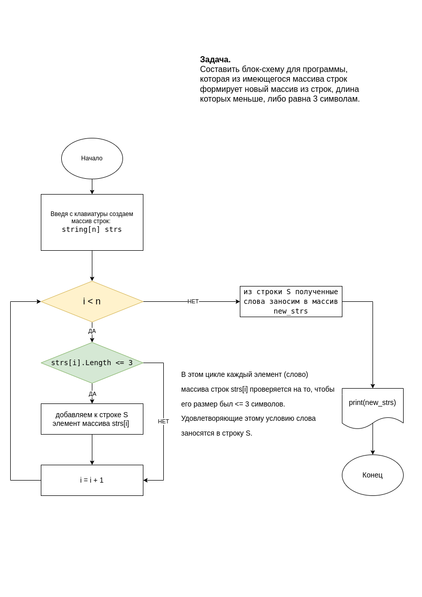

## Разработчик. Итоговая контрольная работа.

Задача:
Написать программу, которая из имеющегося массива строк формирует 
новый массив из строк, длина которых меньше, либо равна 3 символам.
Нарисовать блок-схему алгоритма данной программы.

#### Решение:

В блок-схеме использован следующий алгоритм:

* с клавиатуры вводим размер и содержимое массива строк;
* далее в цикле каждый элемент (слово) массива строк strs[i] проверяется на то, чтобы его размер был <= 3 символов. Удовлетворяющие этому условию слова заносятся в строку S;
* из строки S полученные слова заносим в искомый массив new_strs.

Результат выполнения программы выводится на Терминал.

Блок-схема: 

